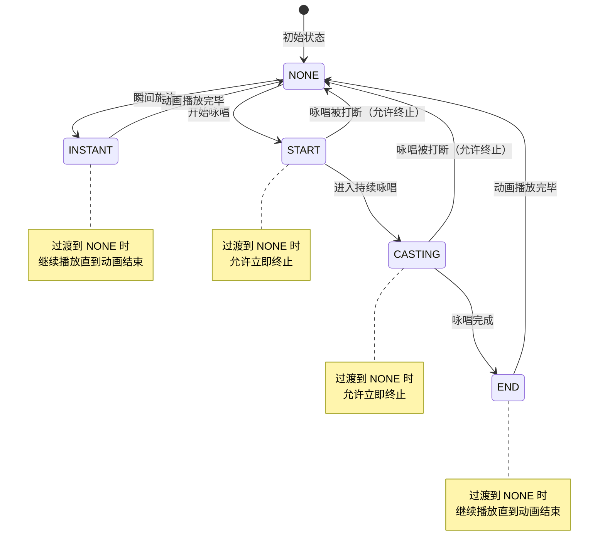

女仆模组从 1.5.0 版本开始提供了魔法施法动画系统，允许开发者为女仆添加自定义的施法动作。
通过该系统，你可以让女仆在使用魔法物品时播放专属的咏唱动画，例如举起法杖、吟唱咒语等。

::: info 适用范围
施法动画系统**仅适用于基于 GeckoLib 的新版模型**（如酒狐系列模型），不支持传统的旧版模型（如默认的东方 Project 模型包）。
:::

本篇将介绍如何使用 `IMagicCastingAnimationProvider` 接口为女仆添加自定义施法动画。

::: warning 重要提示

- 附属需要自行管理咏唱状态、tick 计数等所有数据；
- 本模组不会记录或缓存任何施法相关数据；
- `getMagicCastingState` 方法在每一帧都会被调用，需要注意性能开销。

:::

::: tip 示例附属
你可以参考 [万法皆通与铁魔法的适配](https://github.com/Gardelll/Touhou-Little-Maid-Spell/blob/1.21-neoforge/src/main/java/com/github/yimeng261/maidspell/client/animation/ISSCastingAnimationProvider.java)
来了解部分实现。
:::

## 一、添加动画文件

在你的 mod 的 `animations` 资源目录下，放置对应的基岩版魔法施法动画文件。你可以通过 BlockBench
导入自带的酒狐模型和动画作为参考模板来新建你的施法动画。
例如你在如下位置创建了动画：

::: file-tree

- assets
    - your_mod_id
        - animations
            - magic_instant.json
            - magic_start.json
            - magic_loop.json
            - magic_end.json
              :::

接下来，在客户端侧注册 `DefaultGeckoAnimationEvent` 事件。

需要注意此事件触发的时间非常早，甚至比 `ILittleMaid` 接口读取的时间还要早。故你需要通过注解
`@Mod.EventBusSubscriber(value = Dist.CLIENT)` 来确保事件尽可能早注册。

```java
@Mod.EventBusSubscriber(value = Dist.CLIENT)
public class MyMaidClientEvents {
    @SubscribeEvent
    public static void onGeckoAnimationEvent(DefaultGeckoAnimationEvent event) {
        // 首先获取特定分类的动画
        // 具体的 AnimationType 可参考 DefaultGeckoAnimationEvent.AnimationType 枚举
        // 你可以根据需要添加进不同分类里，反正最后所有的动画文件都会合并在一起
        var file = event.getAnimationFile(DefaultGeckoAnimationEvent.AnimationType.ISS);
        // 接着将自己的动画文件添加进去
        file.addAnimation(new ResourceLocation("your_mod_id", "animations/magic_instant.json"));
        file.addAnimation(new ResourceLocation("your_mod_id", "animations/magic_start.json"));
        file.addAnimation(new ResourceLocation("your_mod_id", "animations/magic_loop.json"));
        file.addAnimation(new ResourceLocation("your_mod_id", "animations/magic_end.json"));
    }
}
```

现在，你已经成功添加了魔法施法动画文件，接下来我们将实现具体的施法动画提供器，从而能让女仆在特定情况下播放这些动画。

## 二、施法动画的阶段说明

魔法施法动画系统基于**状态机**设计，包含以下几个阶段：

| 阶段        | 说明                      |
|-----------|-------------------------|
| `NONE`    | 未施法，女仆处于空闲状态            |
| `START`   | 咏唱开始，播放起手动画（可被打断）       |
| `CASTING` | 持续咏唱，循环播放咏唱动画（可被打断）     |
| `INSTANT` | 瞬发施法，播放瞬发动画（**必须播放完整**） |
| `END`     | 咏唱结束，播放收尾动画（**必须播放完整**） |

### 阶段过渡规则

系统对不同阶段的过渡有特殊的处理规则：

| 前一个阶段     | 当前阶段   | 行为             |
|-----------|--------|----------------|
| `START`   | `NONE` | 允许终止（咏唱被打断）    |
| `CASTING` | `NONE` | 允许终止（咏唱被打断）    |
| `INSTANT` | `NONE` | 继续播放（瞬发动画需要播完） |
| `END`     | `NONE` | 继续播放（收尾动画需要播完） |

::: warning 重要说明
**`INSTANT` 和 `END` 阶段的动画必须播放完整**，即使施法状态已经变为 `NONE`，动画也会继续播放直到结束。这确保了瞬发和收尾动画的完整性，避免动作突兀中断。
:::

### 状态机流程图



## 三、实现施法动画提供器

### 1. 创建实现类

首先，创建一个实现 `IMagicCastingAnimationProvider` 接口的类：

```java
public class ExampleMagicProvider implements IMagicCastingAnimationProvider {    
    /**
     * 判断女仆是否应该播放魔法咏唱动画
     * <p>
     * 此方法在每一帧都会被调用，附属需要自行管理所有状态数据
     * 
     * @param maid 女仆实体
     * @return 如果应该播放魔法动画则返回状态对象，否则返回 null
     */
    @Override
    public IMagicCastingState getMagicCastingState(IMaid maid) {
        // 附属自行判断女仆是否在施法
        // 例如检查女仆是否持有法杖，是否在使用物品等
        if (!isMaidCasting(maid)) {
            return null;
        }
        
        // 附属自行管理咏唱阶段、tick 计数等所有数据
        CastingPhase phase = getCurrentCastingPhase(maid);
        boolean cancelled = isCastingCancelled(maid);
        
        return new SimpleMagicCastingState(phase, cancelled);
    }
    
    /**
     * 根据当前咏唱状态获取对应的动画构建器
     * <p>
     * 本模组不提供默认动画，此方法必须返回有效的 AnimationBuilder
     * 
     * @param maid 女仆实体
     * @param state 当前咏唱状态（保证非 null 且 phase 不为 NONE）
     * @return 动画构建器，如果返回 null 则跳过此动画
     */
    @Override
    public AnimationBuilder getAnimationBuilder(IMaid maid, IMagicCastingState state) {
        // 根据不同阶段返回不同动画
        return switch (state.getCurrentPhase()) {
            case START -> new AnimationBuilder()
                .addAnimation("magic_start", ILoopType.EDefaultLoopTypes.PLAY_ONCE);
            case CASTING -> new AnimationBuilder()
                .addAnimation("magic_loop", ILoopType.EDefaultLoopTypes.LOOP);
            case INSTANT -> new AnimationBuilder()
                .addAnimation("magic_instant", ILoopType.EDefaultLoopTypes.PLAY_ONCE);
            case END -> new AnimationBuilder()
                .addAnimation("magic_end", ILoopType.EDefaultLoopTypes.PLAY_ONCE);
            default -> null;
        };
    }
    
    /**
     * 获取此 provider 的优先级
     * <p>
     * 数字越大优先级越高。
     * 当多个 provider 同时返回非 null 状态时，只使用优先级最高的那个。
     * 相同优先级按注册顺序。
     * 
     * @return 优先级值，默认为 100
     */
    @Override
    public int getPriority() {
        return 150; // 高于默认优先级（100）
    }
    
    // 以下方法需要由附属自行实现
    private boolean isMaidCasting(IMaid maid) {
        // TODO: 检查女仆是否在施法
        // 例如：检查女仆是否持有法杖
        // 例如：检查女仆是否在使用物品
        return false;
    }
    
    private CastingPhase getCurrentCastingPhase(IMaid maid) {
        // TODO: 获取当前咏唱阶段
        // 需要根据你的魔法系统判断当前处于哪个阶段
        return CastingPhase.NONE;
    }
    
    private boolean isCastingCancelled(IMaid maid) {
        // TODO: 检查咏唱是否被取消
        // 例如：女仆受到伤害、被打断等
        return false;
    }
}
```

### 2. 注册施法动画提供器

回到你的 `ILittleMaid` 实现类，重写 `registerMagicCastingAnimation` 方法：

```java
@Mod("example_magic_addon")
public class ExampleMagicAddon implements ILittleMaid {    
    /**
     * 注册施法动画
     * 注意：该方法仅在客户端调用
     */
    @Override
    @OnlyIn(Dist.CLIENT)
    public void registerMagicCastingAnimation(MagicCastingAnimationManager manager) {
        manager.register(new ExampleMagicProvider());
    }
}
```

::: warning 注意
`registerMagicCastingAnimation` 方法**仅在客户端调用**，因此必须添加 `@OnlyIn(Dist.CLIENT)` 注解！
:::

## 四、关键方法说明

### getMagicCastingState

该方法用于判断女仆是否应该播放魔法咏唱动画。**此方法在每一帧都会被调用**，附属需要自行管理所有状态数据（如咏唱阶段、tick
计数等）。

**返回值**：

- 返回 `null` 表示女仆未在施法，不应该播放魔法动画
- 返回 `IMagicCastingState` 实例表示女仆正在施法，并包含当前阶段信息

**重要提示**：

- 本模组不会记录或缓存任何施法相关数据
- 附属必须在每次调用时重新计算并返回当前状态
- 状态数据需要附属自行存储和管理

**示例判断逻辑**：

```java
@Override
public IMagicCastingState getMagicCastingState(IMaid maid) {
    Entity entity = maid.asEntity();
    
    // 检查女仆是否持有法杖类物品
    ItemStack mainHand = entity.getMainHandItem();
    if (!isWandItem(mainHand)) {
        return null;
    }
    
    // 检查女仆是否在使用物品
    if (!entity.isUsingItem()) {
        return null;
    }
    
    // 根据使用时长判断阶段
    int useDuration = entity.getTicksUsingItem();
    CastingPhase phase;
    if (useDuration < 10) {
        phase = CastingPhase.START;
    } else if (useDuration < 60) {
        phase = CastingPhase.CASTING;
    } else {
        phase = CastingPhase.END;
    }
    
    return new SimpleMagicCastingState(phase, false);
}
```

### getAnimationBuilder

该方法根据当前咏唱状态返回对应的动画构建器。**本模组不提供默认动画**，此方法必须返回有效的 AnimationBuilder。

**参数说明**：

- `maid`：女仆实体
- `state`：当前咏唱状态（保证非 null 且 phase 不为 NONE）

**返回值**：

- 返回 `AnimationBuilder` 实例来指定播放的动画
- 返回 `null` 则跳过此动画

**动画循环类型**：

- `PLAY_ONCE`：播放一次后停止，适用于 `START`、`INSTANT`、`END` 阶段
- `LOOP`：循环播放，适用于 `CASTING` 阶段

**注意事项**：

- 动画名称（如 `"magic_start"`）需要与你的动画资源文件名对应
- 如果某个阶段不需要动画，可以返回 `null`

### getPriority

该方法用于获取动画提供器的优先级。数字越大优先级越高。当多个 provider 同时返回非 null 状态时，只使用优先级最高的那个。相同优先级按注册顺序。

**默认值**：100

**推荐数值**：

- `0-50`：低优先级，用于通用动画
- `100`：默认优先级
- `150-200`：高优先级，用于核心魔法系统

## 五、常见问题

::: card title="动画播放不完整就中断了？" icon="twemoji:thinking-face"
检查你的阶段判断逻辑。如果使用 `START` 或 `CASTING` 阶段，这些阶段在状态变为 `NONE` 时会立即终止。如果需要动画播放完整，请使用
`END` 或 `INSTANT` 阶段。
:::

::: card title="多个附属的动画冲突怎么办？" icon="twemoji:collision"
通过调整 `getPriority()` 返回值来设置优先级。优先级高的动画会覆盖优先级低的动画。
:::

::: card title="如何调试动画阶段？" icon="twemoji:bug"
建议在 `getMagicCastingState` 方法中添加日志输出，实时查看女仆的施法状态：

```java
@Override
public IMagicCastingState getMagicCastingState(IMaid maid) {
    CastingPhase phase = getCurrentCastingPhase(maid);
    System.out.println("Current casting phase: " + phase);
    // ...
}
```

:::

